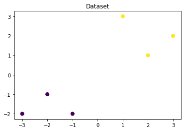
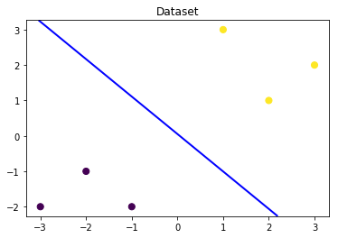
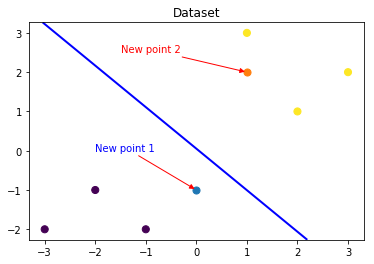
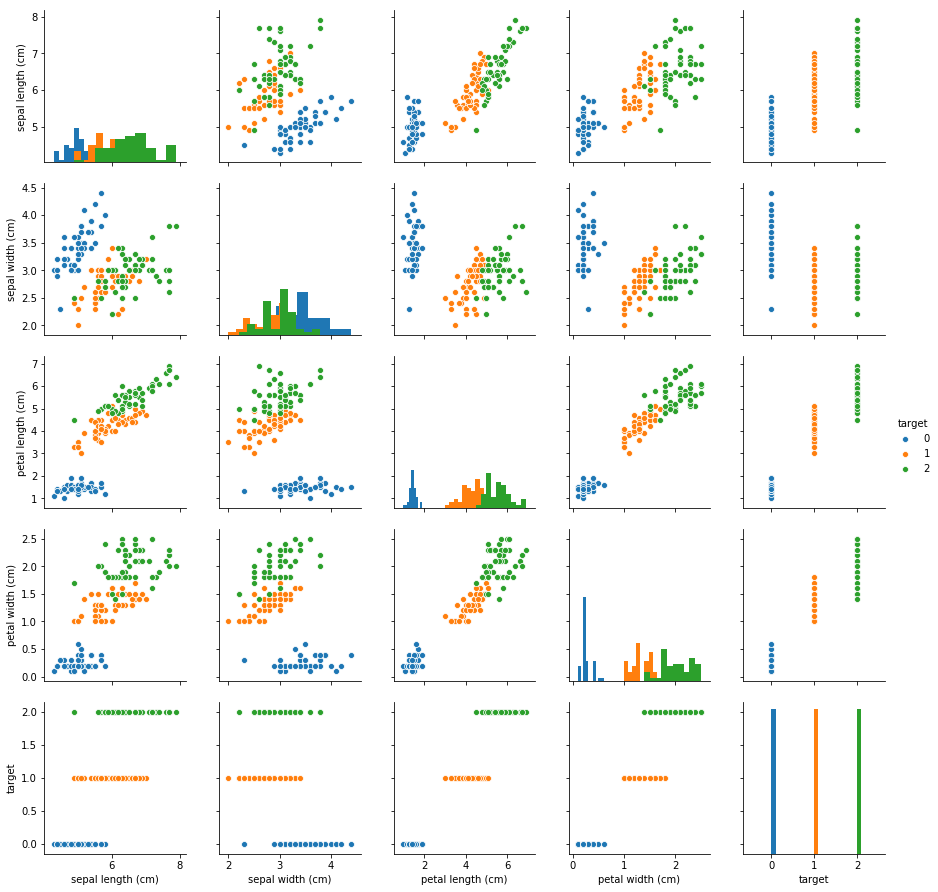
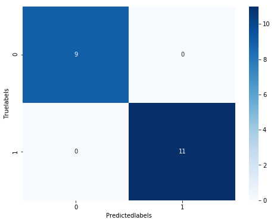
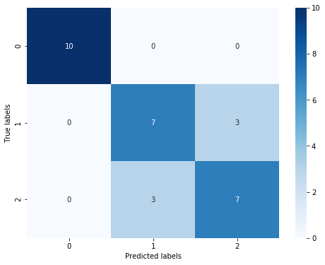
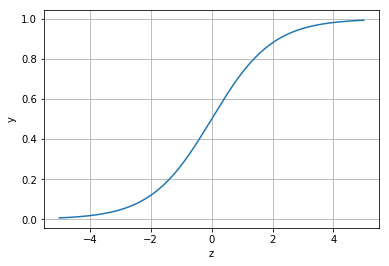

# 机器学习算法梳理（AI入门体验）
## 学习目标:

了解逻辑回归、svm、决策树的算法原理，能够在阿里云notebook环境运行并理解代码。

### Task01：基于逻辑回归的分类预测（2天）
了解逻辑回归的基本原理。
能够完整运行逻辑回归的实现代码。
阿里云notebook：https://developer.aliyun.com/ai/scenario/9ad3416619b1423180f656d1c9ae44f7

逻辑回归其实是一个分类模型,突出的两点: 其模型简单和模型的可解释性强。

** 优点：实现简单，易于理解和实现；计算代价不高，速度很快，存储资源低；

** 缺点：容易欠拟合，分类精度可能不高.

其本质上是一个线性的分类器，所以不能应对较为复杂的数据情况。

### 应用范围：

1）医学领域：Boyd 等人开发的创伤和损伤严重度评分（TRISS）被广泛用于预测受伤患者的死亡率，使用逻辑回归 基于观察到的患者特征（年龄，性别，体重指数,各种血液检查的结果等）分析预测发生特定疾病（例如糖尿病，冠心病）的风险。

2）市场营销: 预测客户购买产品或中止订购的倾向等。

3）商业应用：预测房主拖欠抵押贷款的可能性。

4）作为其他分类算法的基础组件：分类任务中基于GBDT算法+LR逻辑回归实现的信用卡交易反欺诈，CTR(点击通过率)预估等，其好处在于输出值自然地落在0到1之间，并且有概率意义。


## 1.2 学习目标
了解 逻辑回归 的理论
掌握 逻辑回归 的 sklearn 函数调用使用并将其运用到鸢尾花数据集预测

### 2.1 代码流程
#### Part1 Demo实践

 Step1:库函数导入
 
 Step2:模型训练 
 
 Step3:模型参数查看 
 
 Step4:数据和模型可视化 
 
 Step5:模型预测

#### Part2 基于鸢尾花（iris）数据集的逻辑回归分类实践

 Step1:库函数导入 
 
 Step2:数据读取/载入 
 
 Step3:数据信息简单查看 
 
 Step4:可视化描述 
 
 Step5:利用 逻辑回归模型 在二分类上 进行训练和预测 
 
 Step6:利用 逻辑回归模型 在三分类(多分类)上 进行训练和预测

### 3.1 Demo实践

Step1：库函数导入


```python
##  基础函数库
import numpy as np 

## 导入画图库
import matplotlib.pyplot as plt
import seaborn as sns

## 导入逻辑回归模型函数
from sklearn.linear_model import LogisticRegression
```

Step2：训练模型


```python
##Demo演示LogisticRegression分类

## 构造数据集
x_fearures = np.array([[-1, -2], [-2, -1], [-3, -2], [1, 3], [2, 1], [3, 2]])
y_label = np.array([0, 0, 0, 1, 1, 1])

## 调用逻辑回归模型
lr_clf = LogisticRegression()

## 用逻辑回归模型拟合构造的数据集
lr_clf = lr_clf.fit(x_fearures, y_label) #其拟合方程为 y=w0+w1*x1+w2*x2
```

    D:\Anaconda3\lib\site-packages\sklearn\linear_model\logistic.py:433: FutureWarning: Default solver will be changed to 'lbfgs' in 0.22. Specify a solver to silence this warning.
      FutureWarning)
    

Step3：模型参数查看


```python
##查看其对应模型的w
print('the weight of Logistic Regression:',lr_clf.coef_)
##查看其对应模型的w0
print('the intercept(w0) of Logistic Regression:',lr_clf.intercept_)
##the weight of Logistic Regression:[[0.73462087 0.6947908]]
##the intercept(w0) of Logistic Regression:[-0.03643213]
```

    the weight of Logistic Regression: [[0.73462087 0.6947908 ]]
    the intercept(w0) of Logistic Regression: [-0.03643213]
    

Step4：数据和模型可视化


```python
## 可视化构造的数据样本点
plt.figure()
plt.scatter(x_fearures[:,0],x_fearures[:,1], c=y_label, s=50, cmap='viridis')
plt.title('Dataset')
plt.show()
```





```python
# 可视化决策边界
plt.figure()
plt.scatter(x_fearures[:,0],x_fearures[:,1], c=y_label, s=50, cmap='viridis')
plt.title('Dataset')

nx, ny = 200, 100
x_min, x_max = plt.xlim()
y_min, y_max = plt.ylim()
x_grid, y_grid = np.meshgrid(np.linspace(x_min, x_max, nx),np.linspace(y_min, y_max, ny))

z_proba = lr_clf.predict_proba(np.c_[x_grid.ravel(), y_grid.ravel()])
z_proba = z_proba[:, 1].reshape(x_grid.shape)
plt.contour(x_grid, y_grid, z_proba, [0.5], linewidths=2., colors='blue')

plt.show()
```





```python
### 可视化预测新样本

plt.figure()
## new point 1
x_fearures_new1 = np.array([[0, -1]])
plt.scatter(x_fearures_new1[:,0],x_fearures_new1[:,1], s=50, cmap='viridis')
plt.annotate(s='New point 1',xy=(0,-1),xytext=(-2,0),color='blue',arrowprops=dict(arrowstyle='-|>',connectionstyle='arc3',color='red'))

## new point 2
x_fearures_new2 = np.array([[1, 2]])
plt.scatter(x_fearures_new2[:,0],x_fearures_new2[:,1], s=50, cmap='viridis')
plt.annotate(s='New point 2',xy=(1,2),xytext=(-1.5,2.5),color='red',arrowprops=dict(arrowstyle='-|>',connectionstyle='arc3',color='red'))

## 训练样本
plt.scatter(x_fearures[:,0],x_fearures[:,1], c=y_label, s=50, cmap='viridis')
plt.title('Dataset')

# 可视化决策边界
plt.contour(x_grid, y_grid, z_proba, [0.5], linewidths=2., colors='blue')

plt.show()
```





Step5：模型预测


```python
##在训练集和测试集上分布利用训练好的模型进行预测
y_label_new1_predict=lr_clf.predict(x_fearures_new1)
y_label_new2_predict=lr_clf.predict(x_fearures_new2)
print('The New point 1 predict class:\n',y_label_new1_predict)
print('The New point 2 predict class:\n',y_label_new2_predict)
##由于逻辑回归模型是概率预测模型（前文介绍的p = p(y=1|x,\theta)）,所有我们可以利用predict_proba函数预测其概率
y_label_new1_predict_proba=lr_clf.predict_proba(x_fearures_new1)
y_label_new2_predict_proba=lr_clf.predict_proba(x_fearures_new2)
print('The New point 1 predict Probability of each class:\n',y_label_new1_predict_proba)
print('The New point 2 predict Probability of each class:\n',y_label_new2_predict_proba)
##TheNewpoint1predictclass:
##[0]
##TheNewpoint2predictclass:
##[1]
##TheNewpoint1predictProbabilityofeachclass:
##[[0.695677240.30432276]]
##TheNewpoint2predictProbabilityofeachclass:
##[[0.119839360.88016064]]
```

    The New point 1 predict class:
     [0]
    The New point 2 predict class:
     [1]
    The New point 1 predict Probability of each class:
     [[0.67507358 0.32492642]]
    The New point 2 predict Probability of each class:
     [[0.11029117 0.88970883]]
    

可以发现训练好的回归模型将X_new1预测为了类别0（判别面左下侧），X_new2预测为了类别1（判别面右上侧）。

其训练得到的逻辑回归模型的概率为0.5的判别面为上图中蓝色的线。


## 3.2 基于鸢尾花（iris）数据集的逻辑回归分类实践
在实践的最开始，我们首先需要导入一些基础的函数库包括：numpy （Python进行科学计算的基础软件包），pandas（pandas是一种快速，强大，灵活且易于使用的开源数据分析和处理工具），matplotlib和seaborn绘图。


Step1：函数库导入


```python
##  基础函数库
import numpy as np 
import pandas as pd

## 绘图函数库
import matplotlib.pyplot as plt
import seaborn as sns
```

本次我们选择鸢花数据（iris）进行方法的尝试训练，该数据集一共包含5个变量，其中4个特征变量，1个目标分类变量。

共有150个样本，目标变量为 花的类别 其都属于鸢尾属下的三个亚属，分别是山鸢尾 (Iris-setosa)，变色鸢尾(Iris-versicolor)和维吉尼亚鸢尾(Iris-virginica)。

包含的三种鸢尾花的四个特征，分别是花萼长度(cm)、花萼宽度(cm)、花瓣长度(cm)、花瓣宽度(cm)，这些形态特征在过去被用来识别物种。

| 变量 | 描述 |
| -------- | -------- | 
|sepal length   | 花萼长度(cm)    | 
|sepal width    |花萼宽度(cm)     | 
| petal length  | 花瓣长度(cm)     |
|petal width  | 花瓣宽度(cm)    |
|target  | 鸢尾的三个亚属类别,'setosa'(0), 'versicolor'(1), 'virginica'(2)    |


Step2：数据读取/载入


```python
##我们利用sklearn中自带的iris数据作为数据载入，并利用Pandas转化为DataFrame格式
from sklearn.datasets import load_iris
data = load_iris() #得到数据特征
iris_target = data.target #得到数据对应的标签
iris_features = pd.DataFrame(data=data.data, columns=data.feature_names) #利用Pandas转化为DataFrame格式
```

Step3：数据信息简单查看


```python
##利用.info()查看数据的整体信息
iris_features.info()

##<class'pandas.core.frame.DataFrame'>
##RangeIndex:150entries,0to149
##Datacolumns(total4columns):
###ColumnNon-NullCountDtype
##----------------------------
##0sepallength(cm)150non-nullfloat64
##1sepalwidth(cm)150non-nullfloat64
##2petallength(cm)150non-nullfloat64
##3petalwidth(cm)150non-nullfloat64
##dtypes:float64(4)
##memoryusage:4.8KB
```

    <class 'pandas.core.frame.DataFrame'>
    RangeIndex: 150 entries, 0 to 149
    Data columns (total 4 columns):
    sepal length (cm)    150 non-null float64
    sepal width (cm)     150 non-null float64
    petal length (cm)    150 non-null float64
    petal width (cm)     150 non-null float64
    dtypes: float64(4)
    memory usage: 4.8 KB
    


```python
##进行简单的数据查看，我们可以利用.head()头部.tail()尾部
iris_features.head()
```


<div>
<style scoped>
    .dataframe tbody tr th:only-of-type {
        vertical-align: middle;
    }

    .dataframe tbody tr th {
        vertical-align: top;
    }

    .dataframe thead th {
        text-align: right;
    }
</style>
<table border="1" class="dataframe">
  <thead>
    <tr style="text-align: right;">
      <th></th>
      <th>sepal length (cm)</th>
      <th>sepal width (cm)</th>
      <th>petal length (cm)</th>
      <th>petal width (cm)</th>
    </tr>
  </thead>
  <tbody>
    <tr>
      <th>0</th>
      <td>5.1</td>
      <td>3.5</td>
      <td>1.4</td>
      <td>0.2</td>
    </tr>
    <tr>
      <th>1</th>
      <td>4.9</td>
      <td>3.0</td>
      <td>1.4</td>
      <td>0.2</td>
    </tr>
    <tr>
      <th>2</th>
      <td>4.7</td>
      <td>3.2</td>
      <td>1.3</td>
      <td>0.2</td>
    </tr>
    <tr>
      <th>3</th>
      <td>4.6</td>
      <td>3.1</td>
      <td>1.5</td>
      <td>0.2</td>
    </tr>
    <tr>
      <th>4</th>
      <td>5.0</td>
      <td>3.6</td>
      <td>1.4</td>
      <td>0.2</td>
    </tr>
  </tbody>
</table>
</div>


```python
iris_features.tail()
```


<div>
<style scoped>
    .dataframe tbody tr th:only-of-type {
        vertical-align: middle;
    }

    .dataframe tbody tr th {
        vertical-align: top;
    }

    .dataframe thead th {
        text-align: right;
    }
</style>
<table border="1" class="dataframe">
  <thead>
    <tr style="text-align: right;">
      <th></th>
      <th>sepal length (cm)</th>
      <th>sepal width (cm)</th>
      <th>petal length (cm)</th>
      <th>petal width (cm)</th>
    </tr>
  </thead>
  <tbody>
    <tr>
      <th>145</th>
      <td>6.7</td>
      <td>3.0</td>
      <td>5.2</td>
      <td>2.3</td>
    </tr>
    <tr>
      <th>146</th>
      <td>6.3</td>
      <td>2.5</td>
      <td>5.0</td>
      <td>1.9</td>
    </tr>
    <tr>
      <th>147</th>
      <td>6.5</td>
      <td>3.0</td>
      <td>5.2</td>
      <td>2.0</td>
    </tr>
    <tr>
      <th>148</th>
      <td>6.2</td>
      <td>3.4</td>
      <td>5.4</td>
      <td>2.3</td>
    </tr>
    <tr>
      <th>149</th>
      <td>5.9</td>
      <td>3.0</td>
      <td>5.1</td>
      <td>1.8</td>
    </tr>
  </tbody>
</table>
</div>


```python
##其对应的类别标签为，其中0，1，2分别代表'setosa','versicolor','virginica'三种不同花的类别

iris_target


##array([0,0,0,0,0,0,0,0,0,0,0,0,0,0,0,0,0,0,0,0,0,0,


##0,0,0,0,0,0,0,0,0,0,0,0,0,0,0,0,0,0,0,0,0,0,


##0,0,0,0,0,0,1,1,1,1,1,1,1,1,1,1,1,1,1,1,1,1,


##1,1,1,1,1,1,1,1,1,1,1,1,1,1,1,1,1,1,1,1,1,1,


##1,1,1,1,1,1,1,1,1,1,1,1,2,2,2,2,2,2,2,2,2,2,


##2,2,2,2,2,2,2,2,2,2,2,2,2,2,2,2,2,2,2,2,2,2,


##2,2,2,2,2,2,2,2,2,2,2,2,2,2,2,2,2,2])
```


    array([0, 0, 0, 0, 0, 0, 0, 0, 0, 0, 0, 0, 0, 0, 0, 0, 0, 0, 0, 0, 0, 0,
           0, 0, 0, 0, 0, 0, 0, 0, 0, 0, 0, 0, 0, 0, 0, 0, 0, 0, 0, 0, 0, 0,
           0, 0, 0, 0, 0, 0, 1, 1, 1, 1, 1, 1, 1, 1, 1, 1, 1, 1, 1, 1, 1, 1,
           1, 1, 1, 1, 1, 1, 1, 1, 1, 1, 1, 1, 1, 1, 1, 1, 1, 1, 1, 1, 1, 1,
           1, 1, 1, 1, 1, 1, 1, 1, 1, 1, 1, 1, 2, 2, 2, 2, 2, 2, 2, 2, 2, 2,
           2, 2, 2, 2, 2, 2, 2, 2, 2, 2, 2, 2, 2, 2, 2, 2, 2, 2, 2, 2, 2, 2,
           2, 2, 2, 2, 2, 2, 2, 2, 2, 2, 2, 2, 2, 2, 2, 2, 2, 2])


```python
##利用value_counts函数查看每个类别数量

pd.Series(iris_target).value_counts()

##2    50

##1    50

##0    50

##dtype:int64
```


    2    50
    1    50
    0    50
    dtype: int64


```python
##对于特征进行一些统计描述

iris_features.describe()
```


<div>
<style scoped>
    .dataframe tbody tr th:only-of-type {
        vertical-align: middle;
    }

    .dataframe tbody tr th {
        vertical-align: top;
    }

    .dataframe thead th {
        text-align: right;
    }
</style>
<table border="1" class="dataframe">
  <thead>
    <tr style="text-align: right;">
      <th></th>
      <th>sepal length (cm)</th>
      <th>sepal width (cm)</th>
      <th>petal length (cm)</th>
      <th>petal width (cm)</th>
    </tr>
  </thead>
  <tbody>
    <tr>
      <th>count</th>
      <td>150.000000</td>
      <td>150.000000</td>
      <td>150.000000</td>
      <td>150.000000</td>
    </tr>
    <tr>
      <th>mean</th>
      <td>5.843333</td>
      <td>3.057333</td>
      <td>3.758000</td>
      <td>1.199333</td>
    </tr>
    <tr>
      <th>std</th>
      <td>0.828066</td>
      <td>0.435866</td>
      <td>1.765298</td>
      <td>0.762238</td>
    </tr>
    <tr>
      <th>min</th>
      <td>4.300000</td>
      <td>2.000000</td>
      <td>1.000000</td>
      <td>0.100000</td>
    </tr>
    <tr>
      <th>25%</th>
      <td>5.100000</td>
      <td>2.800000</td>
      <td>1.600000</td>
      <td>0.300000</td>
    </tr>
    <tr>
      <th>50%</th>
      <td>5.800000</td>
      <td>3.000000</td>
      <td>4.350000</td>
      <td>1.300000</td>
    </tr>
    <tr>
      <th>75%</th>
      <td>6.400000</td>
      <td>3.300000</td>
      <td>5.100000</td>
      <td>1.800000</td>
    </tr>
    <tr>
      <th>max</th>
      <td>7.900000</td>
      <td>4.400000</td>
      <td>6.900000</td>
      <td>2.500000</td>
    </tr>
  </tbody>
</table>
</div>


从统计描述中我们可以看到不同数值特征的变化范围。


Step4:可视化描述


```python
## 合并标签和特征信息
iris_all = iris_features.copy() ##进行浅拷贝，防止对于原始数据的修改
iris_all['target'] = iris_target
```


```python
## 特征与标签组合的散点可视化
sns.pairplot(data=iris_all,diag_kind='hist', hue= 'target')
plt.show()
```





从上图可以发现，在2D情况下不同的特征组合对于不同类别的花的散点分布，以及大概的区分能力。


```python
for col in iris_features.columns:
    sns.boxplot(x='target', y=col, saturation=0.5, 
palette='pastel', data=iris_all)
    plt.title(col)
    plt.show()
```


利用箱型图我们也可以得到不同类别在不同特征上的分布差异情况。


```python
# 选取其前三个特征绘制三维散点图
from mpl_toolkits.mplot3d import Axes3D

fig = plt.figure(figsize=(10,8))
ax = fig.add_subplot(111, projection='3d')

iris_all_class0 = iris_all[iris_all['target']==0].values
iris_all_class1 = iris_all[iris_all['target']==1].values
iris_all_class2 = iris_all[iris_all['target']==2].values
# 'setosa'(0), 'versicolor'(1), 'virginica'(2)
ax.scatter(iris_all_class0[:,0], iris_all_class0[:,1], iris_all_class0[:,2],label='setosa')
ax.scatter(iris_all_class1[:,0], iris_all_class1[:,1], iris_all_class1[:,2],label='versicolor')
ax.scatter(iris_all_class2[:,0], iris_all_class2[:,1], iris_all_class2[:,2],label='virginica')
plt.legend()

plt.show()
```


Step5:利用 逻辑回归模型 在二分类上 进行训练和预测


```python
##为了正确评估模型性能，将数据划分为训练集和测试集，并在训练集上训练模型，在测试集上验证模型性能。
from sklearn.model_selection import train_test_split
##选择其类别为0和1的样本（不包括类别为2的样本）
iris_features_part=iris_features.iloc[:100]
iris_target_part=iris_target[:100]
##测试集大小为20%，80%/20%分
x_train,x_test,y_train,y_test=train_test_split(iris_features_part,iris_target_part,test_size=0.2,random_state=2020)
```


```python
##从sklearn中导入逻辑回归模型
from sklearn.linear_model import LogisticRegression
```


```python
##定义逻辑回归模型
clf=LogisticRegression(random_state=0,solver='lbfgs')
```


```python
##在训练集上训练逻辑回归模型
clf.fit(x_train,y_train)
```


    LogisticRegression(C=1.0, class_weight=None, dual=False, fit_intercept=True,
              intercept_scaling=1, max_iter=100, multi_class='warn',
              n_jobs=None, penalty='l2', random_state=0, solver='lbfgs',
              tol=0.0001, verbose=0, warm_start=False)


```python
##查看其对应的w
print('the weight of Logistic Regression:',clf.coef_)

##查看其对应的w0
print('the intercept(w0) of Logistic Regression:',clf.intercept_)
```

    the weight of Logistic Regression: [[ 0.45181973 -0.81743611  2.14470304  0.89838607]]
    the intercept(w0) of Logistic Regression: [-6.53367714]
    


```python

##在训练集和测试集上分布利用训练好的模型进行预测
train_predict=clf.predict(x_train)
test_predict=clf.predict(x_test)
```


```python
from sklearn import metrics
##利用accuracy（准确度）【预测正确的样本数目占总预测样本数目的比例】评估模型效果
print('The accuracy of the Logistic Regression is:',metrics.accuracy_score(y_train,train_predict))
print('The accuracy of the Logistic Regression is:',metrics.accuracy_score(y_test,test_predict))

##查看混淆矩阵(预测值和真实值的各类情况统计矩阵)
confusion_matrix_result=metrics.confusion_matrix(test_predict,y_test)
print('The confusion matrix result:\n',confusion_matrix_result)

##利用热力图对于结果进行可视化
plt.figure(figsize=(8,6))
sns.heatmap(confusion_matrix_result,annot=True,cmap='Blues')
plt.xlabel('Predictedlabels')
plt.ylabel('Truelabels')
plt.show()

##The accuracy of the Logistic Regressionis:1.0
##The accuracy of the Logistic Regressionis:1.0
##The confusion matrix result:
##[[9  0]
##[0  11]]
```

    The accuracy of the Logistic Regression is: 1.0
    The accuracy of the Logistic Regression is: 1.0
    The confusion matrix result:
     [[ 9  0]
     [ 0 11]]
    





我们可以发现其准确度为1，代表所有的样本都预测正确了。

Step6:利用 逻辑回归模型 在三分类(多分类)上 进行训练和预测


```python
##测试集大小为20%，80%/20%分
x_train,x_test,y_train,y_test=train_test_split(iris_features,iris_target,test_size=0.2,random_state=2020)
```


```python
##定义逻辑回归模型
clf=LogisticRegression(random_state=0,solver='lbfgs')
```


```python
##在训练集上训练逻辑回归模型
clf.fit(x_train,y_train)
```

    D:\Anaconda3\lib\site-packages\sklearn\linear_model\logistic.py:460: FutureWarning: Default multi_class will be changed to 'auto' in 0.22. Specify the multi_class option to silence this warning.
      "this warning.", FutureWarning)
    


    LogisticRegression(C=1.0, class_weight=None, dual=False, fit_intercept=True,
              intercept_scaling=1, max_iter=100, multi_class='warn',
              n_jobs=None, penalty='l2', random_state=0, solver='lbfgs',
              tol=0.0001, verbose=0, warm_start=False)


```python
##查看其对应的w
print('the weight of Logistic Regression:\n',clf.coef_)
##查看其对应的w0
print('the intercept(w0) of Logistic Regression:\n',clf.intercept_)
##由于这个是3分类，所有我们这里得到了三个逻辑回归模型的参数，其三个逻辑回归组合起来即可实现三分类
```

    the weight of Logistic Regression:
     [[-0.43476516  0.88611834 -2.18912786 -0.94014751]
     [-0.38565072 -2.66413298  0.75758301 -1.38261087]
     [-0.00811281  0.11312037  2.52971372  2.35084911]]
    the intercept(w0) of Logistic Regression:
     [  6.26404984   8.32611826 -16.63593196]
    


```python
##在训练集和测试集上分布利用训练好的模型进行预测
train_predict=clf.predict(x_train)
test_predict=clf.predict(x_test)
##由于逻辑回归模型是概率预测模型（前文介绍的p=p(y=1|x,\theta)）,所有我们可以利用predict_proba函数预测其概率

train_predict_proba=clf.predict_proba(x_train)
test_predict_proba=clf.predict_proba(x_test)

print('The test predict Probability of each class:\n',test_predict_proba)
##其中第一列代表预测为0类的概率，第二列代表预测为1类的概率，第三列代表预测为2类的概率。

##利用accuracy（准确度）【预测正确的样本数目占总预测样本数目的比例】评估模型效果
print('The accuracy of the Logistic Regression is:',metrics.accuracy_score(y_train,train_predict))
print('The accuracy of the Logistic Regression is:',metrics.accuracy_score(y_test,test_predict))
```

    The test predict Probability of each class:
     [[1.34629657e-04 2.39439258e-01 7.60426112e-01]
     [6.97709974e-01 3.02286872e-01 3.15488105e-06]
     [3.37911357e-02 7.25748311e-01 2.40460553e-01]
     [5.66045749e-03 6.54606650e-01 3.39732893e-01]
     [1.07001604e-02 6.73571458e-01 3.15728381e-01]
     [8.97257212e-04 6.64944383e-01 3.34158360e-01]
     [4.09569374e-04 3.85867863e-01 6.13722567e-01]
     [1.25656705e-01 8.70776967e-01 3.56632803e-03]
     [8.72513103e-01 1.27468517e-01 1.83801129e-05]
     [9.08521668e-01 9.14693374e-02 8.99499116e-06]
     [3.90118125e-04 3.06201906e-01 6.93407976e-01]
     [6.24601292e-03 7.19030139e-01 2.74723848e-01]
     [8.87240986e-01 1.12754805e-01 4.20834569e-06]
     [2.33796289e-03 4.47048931e-01 5.50613106e-01]
     [8.66660871e-04 4.21991280e-01 5.77142059e-01]
     [9.22534832e-01 7.74607080e-02 4.45953703e-06]
     [1.99868815e-02 9.35481190e-01 4.45319280e-02]
     [1.72044043e-02 5.07825694e-01 4.74969902e-01]
     [1.86212027e-04 3.16418321e-01 6.83395467e-01]
     [5.65903417e-01 4.34094203e-01 2.37989840e-06]
     [8.21399340e-01 1.78597706e-01 2.95421913e-06]
     [3.06252963e-04 5.16365479e-01 4.83328269e-01]
     [4.75225481e-03 2.88747924e-01 7.06499822e-01]
     [8.57382205e-01 1.42610982e-01 6.81310902e-06]
     [7.08084953e-04 2.47280583e-01 7.52011332e-01]
     [5.32353599e-02 8.32113047e-01 1.14651593e-01]
     [2.37306175e-02 3.53509337e-01 6.22760046e-01]
     [1.64496053e-03 3.48529962e-01 6.49825077e-01]
     [7.66906190e-01 2.33089366e-01 4.44392922e-06]
     [9.29325598e-01 7.06550525e-02 1.93496160e-05]]
    The accuracy of the Logistic Regression is: 0.9583333333333334
    The accuracy of the Logistic Regression is: 0.8
    


```python
##查看混淆矩阵
confusion_matrix_result=metrics.confusion_matrix(test_predict,y_test)
print('The confusion matrix result:\n',confusion_matrix_result)

##利用热力图对于结果进行可视化
plt.figure(figsize=(8,6))
sns.heatmap(confusion_matrix_result,annot=True,cmap='Blues')
plt.xlabel('Predicted labels')
plt.ylabel('True labels')
plt.show()

##The confusion matrix result:
##[[10  0   0]
##[0   8   2] 
##[0   2   8]]
```

    The confusion matrix result:
     [[10  0  0]
     [ 0  7  3]
     [ 0  3  7]]
    





## 4.1 逻辑回归原理简介
当z≥0 时,y≥0.5,分类为1，当 z<0时,y<0.5,分类为0，其对应的y值我们可以视为类别1的概率预测值。

Logistic回归虽然名字里带“回归”，但是它实际上是一种分类方法，主要用于两分类问题（即输出只有两种，分别代表两个类别），所以利用了Logistic函数（或称为Sigmoid函数），函数形式为：

$log(z) = \frac{1}{(1 + e^{-z} )}$

对应的函数图像可以表示如下:


```python
import numpy as np
import matplotlib.pyplot as plt
x = np.arange(-5,5,0.01)
y = 1/(1+np.exp(-x))

plt.plot(x,y)
plt.xlabel('z')
plt.ylabel('y')
plt.grid()
plt.show()
```





通过上图我们可以发现 Logistic 函数是单调递增函数，并且在z=0,
$p = p(y =1 | x,\theta) = h_\theta(x, \theta) = \frac{1}{1 + e^{-(w_0 + \sum_{i}^{N}w_ix_i)}}$

逻辑回归其实是实现了一个决策边界：对于函数$y = \frac{1}{(1 + e^{-z} )}$，当z≥0 时,y≥0.5,分类为1，当 z<0时,y<0.5,分类为0，其对应的y值我们可以视为类别1的概率预测值。


对于模型的训练而言：实质上来说就是利用数据求解出对应的模型的特定的ω。从而得到一个针对于当前数据的特征逻辑回归模型。

而对于多分类而言，将多个二分类的逻辑回归组合，即可实现多分类。


```python

```
